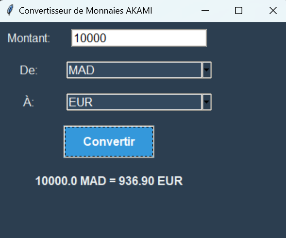

# 💱 Convertisseur de Monnaies


**Convertisseur de Monnaies** est un logiciel qui permet de convertir des montants d’une devise à une autre en utilisant les taux de change actuels.

## 📋 Fonctionnalités

- Conversion de montants entre plusieurs devises
- Sélection de la devise source et de la devise cible
- Récupération des taux de change en temps réel via une API gratuite

## 🔧 Installation

### Prérequis
- **Python 3.8+**

### Installation des Dépendances
1. Clonez le repository :
   ```bash
   git clone https://github.com/votre_nom_d_utilisateur/convertisseur_devises.git
   cd convertisseur_devises

### 📜 License
Ce projet est sous licence MIT - voir le fichier [LICENSE]() pour plus de détails.

### 📫 Remerciements
Merci à l’API ExchangeRate-API pour les taux de change en temps réel.

## 🎉 Aperçu de l'Interface



